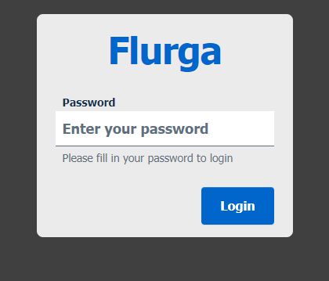
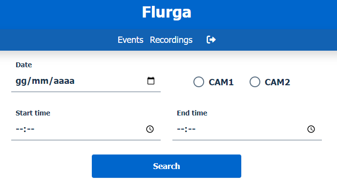
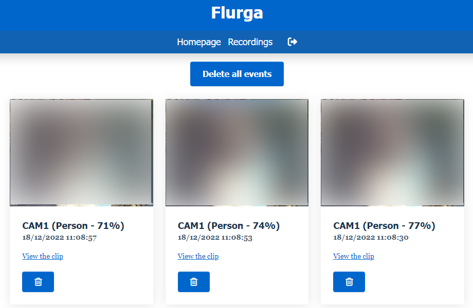
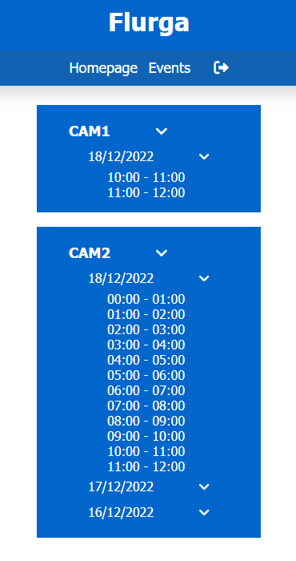

<p align="center"></p>
<h1 align="center">Flurga</h1>
<p align="center">Flurga is a web interface for Frigate NVR build with "Bootstrap Italia" theme<br><br>   </p>

## Features
- **Simple login system**
- **View and download custom length recording**
- **View and delete events**
- **Delete all events at once**
- **View all recordings**

## Installation with docker compose
<a href="https://hub.docker.com/r/bthuderous/flurga">Docker Image (bthuderous/flurga)</a>
```yaml
version: "3"

services:
  flurga:
    image: bthuderous/flurga:latest
    container_name: Flurga
    restart: unless-stopped
    ports:
      - 8080:8080
    volumes:
      - /home/user/flurga/config.yml:/flurga/config.yml
```

## Config file
```yaml
flurga:
  # Username and password for Flurga login
  username: admin
  password: default123
  timezone: Europe/Rome
  lang: en
  
frigate:
  # Frigate IP:PORT
  host: 192.168.144.16:5000

  # Cameras list
  cameras:
    - CAM1
    - CAM2
```

## Problems / Questions
As with any beta, there may be some bugs and frequent updates, but we encourage you to report any issues!<br><br>
<b>Email:</b> flurga@vcardone.it - <b>Discord:</b> Block2Paz#4884

## Screenshot
<p align="center"></p>
<p align="center"></p>
<p align="center"></p>
<p align="center"></p>
